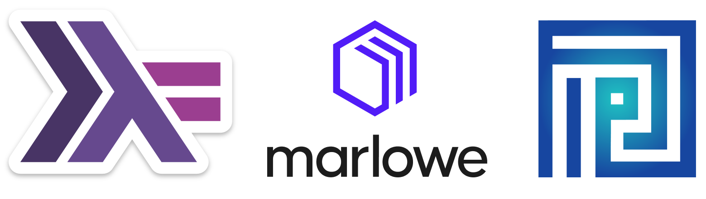

    
  <h1>Welcome to the Cardano Developer Course</h1>

- **Instructor:**
  - [Lars Brünjes](email:lars.bruenjes@iohk.io)
- **TAs**
  - [Karina Lopez](email:karina.lopez@iohk.io)
  - [Robertino Martinez](email:robertino.martinez@iohk.io)

## Course Description

This is a full-time 8-week course that will take you from zero to a productive Haskell and Smart Contract developer. In this course, we'll learn Haskell (an advanced, purely functional programming language), Marlowe (an ecosystem of tools and languages to enable the development of financial and transactional smart contracts), and Plutus (the smart contract platform of the Cardano blockchain).

Here's a high-level overview of each week's contents:

**⚠️ IMPORTANT!: The original schedule and outline have been heavily modified due to the students' lack of time (see "Lectures" section). ⚠️**

- **Week 1 (Haskell - 07/08):** Introduction to Haskell's syntax, core principles, and IO.
- **Week 2 (Haskell - 14/08):** Testing, common abstractions, tools, and testing.
- **Week 3 (Haskell - 21/08):** More abstractions, writing non-trivial programs, and data structures.
- **Week 4 (Haskell - 28/08):** Combining effects, concurrency and parallelism, and Networking.
- **Week 5 (Marlowe - 04/09):** Write smart contracts with Marlowe.
- **Week 6 (Plutus  - 11/09):** Cardano Blockchain, EUTxO, Plutus tooling and simple Plutus contracts.
- **Catchup week (18/09):**     Rest, catch up and prepare for the final two weeks. 
- **Week 7 (Plutus  - 18/09 or 25/09):** Non-trivial Plutus smart contracts and complete Dapps.
- **Week 8 (Plutus  - 25/09 or 02/10):** Final project (chosen by the students) or More Dapps.

## Getting the Software

To go through this course, you will need:

### Haskell:
- `ghc` (the Haskell compiler) version 9.2.5.
- `cabal-install` and Cabal library (a build tool for Haskell) version 3.6.2.0.
- Haskell's Language Server
- A suitable text editor or IDE (e.g., VSCode, (Neo)Vim, Emacs) with proper configuration.

**If you want to start working on your own code**, we recommend using [this template](https://github.com/iohkedu-ke2023/haskell-template) which comes with a development environment ready to go.

**If you want to run the examples in this repo, choose the one you prefer:**
- Remote development environment: [Install the GitPod extension](https://www.gitpod.io/docs/configure/user-settings/browser-extension), and click the new "Gitpod" button at the top of the repo.
- Local development environment inside Docker: Make sure you have the latest version of [Docker Desktop](https://www.docker.com/products/docker-desktop/) and [VSCode](https://code.visualstudio.com/). Open the `examples-haskell` folder in VSCode (not the root of the repo). You'll get a notification about a Dev Container config file. Click on "Reopen in Container".
- Local development environment directly on your computer using GHCup: Follow [these instructions](https://www.youtube.com/watch?v=hSN5mxITv0A&list=PLNEK_Ejlx3x1D9Vq5kqeC3ZDEP7in4dqb&index=13) (all platforms).

### Marlowe
- A local Docker instance or online environment provided by the instructors.

Instructions on how to install the necessary software will be available here when needed.

### Plutus
- A local Docker instance or online environment provided by the instructors.

Instructions on how to install the necessary software will be available here when needed.

## How to get help

- [Discord for this course](https://discord.gg/XEd3hbCZ)
- [Haskell tag stackoverflow.com](https://stackoverflow.com/questions/tagged/haskell)
- [IOG Technical Community](https://discord.com/invite/inputoutput)

## Lectures

|      ID     | Lecture and slides                                       | Assignments                                            | Projects                                            |
|-------------|----------------------------------------------------------|--------------------------------------------------------|-----------------------------------------------------|
| **Week 01** |                                                          |                                                        |                                                     |
| Lecture 000 | Welcome                                                  |                                                        |                                                     |
| Lecture 010 | Introduction to Cryptocurrencies                         |                                                        |                                                     |
| Lecture 020 | An Overview of Haskell                                   |     [A2](https://classroom.github.com/a/vGW6fZNQ)      |                                                     |
| Lecture 030 | Datatypes & Functions                                    |     [A3](https://classroom.github.com/a/cPPqAw1u)      |                                                     |
| Lecture 040 | Polymorphism & Type Classes                              |     --                                                 |                                                     |
| Lecture 050 | Higher-Order Functions                                   |     [A5](https://classroom.github.com/a/ELufokIr)      |                                                     |
|             | Packaging & Tools                                        |     --                                                 |                                                     |
| Lecture 060 | IO                                                       |     [A6](https://classroom.github.com/a/FtEiTAuM) / T1 |                                                     |
| **Week 02** |                                                          |   **[W1](https://classroom.github.com/a/SCL-tjks)**    |                                                     |
| Lecture 060 | Testing                                                  |                                                        |                                                     |
| Lecture 070 | Abstraction Patterns                                     |                                                        |                                                     |
| Lecture 080 | Concurrency                                              |                                                        |                                                     |
| Lecture 090 | Network Servers                                          |                                                        |                                                     |
| Lecture 100 | Parser Combinators                                       |                                                        |                                                     |
| **Week 03** |                                                          |                                                        |                                                     |
| Lecture 120 | Data Structures                                          |                                                        |                                                     |
| **Week 04** |                                                          |                                                        |                                                     |
| Lecture 130 | More Data Structures                                     |                                                        |                                                     |
| Lecture 140 | Optics                                                   |                                                        |                                                     |
| **Week 05** |                                                          |   **[W2](https://classroom.github.com/a/YpgS8kB5)**    |  **[P1](https://classroom.github.com/a/rdivOq_L)**  |
| Lecture 150 | More on Optics                                           |                                                        |                                                     |
| Lecture 160 | More on Monads (MonadT)                                  |                                                        |                                                     |
| **Week 06** |                                                          |   **[W3](https://classroom.github.com/a/0PEjxAov)**    |                                                     |
| Lecture 150 | Free Monads                                              |                                                        |                                                     |
| Lecture 160 | Generics                                                 |                                                        |                                                     |
| **Week 07** |                                                          |   **[W4](https://classroom.github.com/a/L1O7zRdt)**                                               |                                                     |
| BREAK       |                                                          |                                                        |                                                     |
| **Week 08** |                                                          |   **W5**                                               |                                                     |
| Lecture 160 | Template Haskell                                         |                                                        |                                                     |
| **Week 09** |                                                          |                                                        |                                                     |
| Lecture 150 | Web development                                          |                                                        |                                                     |
| Lecture 160 | Introduction to Marlowe                                  |                                                        |                                                     |
| **Week 10** |                                                          |                                                        |                                                     |
| Lecture 170 | Marlowe Smart Contracts and infrastructure               |                                                        |                                                     |
| Lecture 180 | Introduction to Plutus (EUTxO and untyped Plutus)        |                                                        |                                                     |
| **Week 11** |                                                          |                                                        |                                                     |
| Lecture 190 | Typed Plutus                                             |                                                        |                                                     |
| Lecture 200 | Handling time and minting wiht Plutus                    |                                                        |                                                     |
| **Week 12** |                                                          |                                                        |                                                     |
| Lecture 210 | Testing Plutus contracts                                 |                                                        |                                                     |
| Lecture 220 | Builging a Stable Coin Dapp                              |                                                        |                                                     |
| **Week 13** |                                                          |                                                        |                                                     |
| HOMEWORK    | FINAL PROJECT                                            |                                                        |                                                     |

### Assignments

Daily assignments are due the next day.

Weekly homework is due Mondays before the lecture, one week after they have been handed out.

All submissions are via GitHub Classroom.

### Defects

If you find a defect in one of the sample programs or slides (typos included), please, open an issue on this GitHub repository.

### Bibliography

#### Haskell

0. IOG Academy. [Haskell Course](https://github.com/input-output-hk/haskell-course). YouTube.

> Beginner-friendly Haskell course.

We have read most of these books and they provide good information for beginners.

1. Lipovača M. [Learn You A Haskell For Great Good!](http://learnyouahaskell.com/). San Francisco: No Starch Press; 2012.

>Beginner Friendly book with lots of examples.

2. O'Sullivan B, Stewart D, Goerzen J. [Real World Haskell](http://book.realworldhaskell.org/). Farnham: O'Reilly; 2009.

>A lot of real-world techniques, just a little bit outdated at this point.

3. Bird R. [Algorithm Design With Haskell](https://www.amazon.com/Algorithm-Design-Haskell-Richard-Bird-ebook/dp/B08BKXJ1N3/ref=tmm_kin_swatch_0?_encoding=UTF8&qid=1597814133&sr=8-1). Cambridge University Press; 2020.

>Learn how far you can get with immutable data, to implement almost all standard algorithms.

4. Thibaut C. [Texas Hold'em: The Little Haskeller](https://leanpub.com/texasholdem-tlh).leanpub.com; 2019.

>A long article, written in the Question and Answer format. Like the Little Schemer.

5. Penner C. [Optics By Example: Functional Lenses In Haskell](https://leanpub.com/optics-by-example). leanpub.com; 2020.

>The only book on optics.

6. Haskell Org. More resources at [Hakell's official website](https://www.haskell.org/documentation/).

> It contains dozens of resources from various sources.

#### Marlowe

7. IOG. [Marlowe official documentation](https://docs.marlowe.iohk.io/docs/introduction).

#### Plutus

8. IOG. PlutusTx [official documentation](https://plutus.readthedocs.io/en/latest/).

9. IOG. Plutus Core [repository](https://github.com/input-output-hk/plutus).
